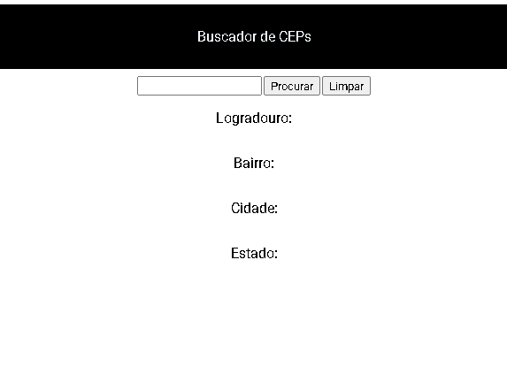

# Projeto buscador de Ceps
O objetivo do projeto e buscar ceps atraves de uma API chamada: https://viacep.com.br/

## Design de projetos


## API utilizada
A api  https://viacep.com.br/ retorna um json contendo as seguintes informações para um cep de exemplo:

```
// https://viacep.com.br/ws/01001000/json/
{
  "cep": "01001-000",
  "logradouro": "Praça da Sé",
  "complemento": "lado ímpar",
  "unidade": "",
  "bairro": "Sé",
  "localidade": "São Paulo",
  "uf": "SP",
  "estado": "São Paulo",
  "regiao": "Sudeste",
  "ibge": "3550308",
  "gia": "1004",
  "ddd": "11",
  "siafi": "7107"
}
```
## Funcionalidades
- [x] buscar do CEP
- [x] Limpa dados

## Observação
>[!NOTE]
>Projeto feito na disciplina de programação web 1 do curso ADS do ifce de jaguaruana/CE

>[!IMPORTANT]
>Alguns CEPs podem não conter todas as informações.

## Contatos

- Email: joaorob.m.l@gmail.com
- Linkedin: www.linkedin.com/in/joão-victor-morais-762181236